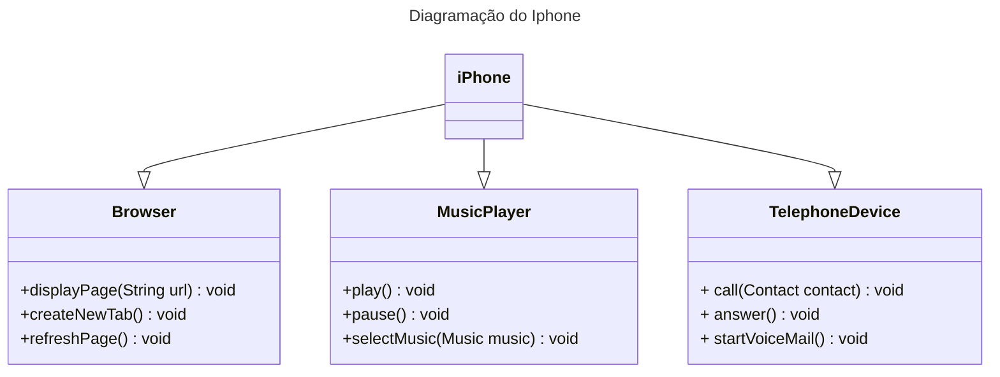

```mermaid
---
title: Diagramação do Iphone
---
classDiagram
    iPhone --|> Browser
    iPhone --|> MusicPlayer
    iPhone --|> TelephoneDevice

    class iPhone {
    }

    class Browser {
        +displayPage(String url) void
        +createNewTab() void
        +refreshPage() void
    }

    class MusicPlayer {
        +play() void
        +pause() void
        +selectMusic(Music music) void
    }

    class TelephoneDevice {
        + call(Contact contact) void
        + answer() void
        + startVoiceMail() void
    }

```